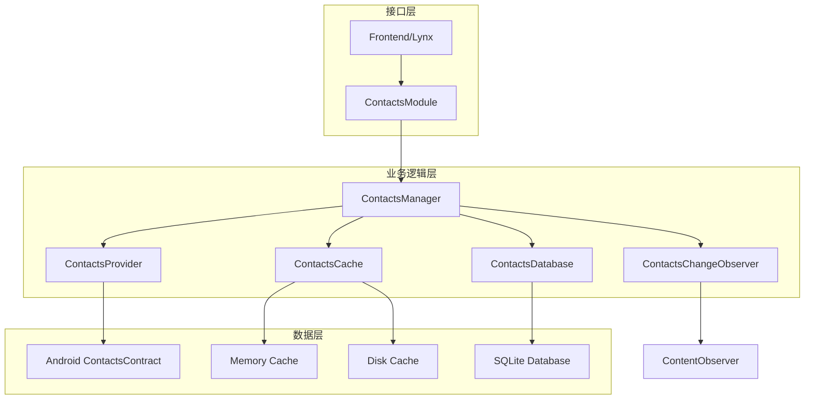

# 通讯录模块重新设计方案

## 1. 现状分析

### 当前实现
- 使用第三方库：`com.github.vestrel00:contacts-android:0.4.0`
- 主要类：`ContactsModule`、`ContactsManager`
- 功能：基本的联系人读取、分页、搜索

### 存在的问题
- 依赖第三方库，增加包体积
- 性能不够优化
- 功能相对简单
- 缺乏增量更新机制

## 2. 新架构设计

### 2.1 数据模型

```java
// 联系人基础信息
public class ContactInfo {
    private String id;              // 联系人ID
    private String displayName;     // 显示名称
    private String firstName;       // 名
    private String lastName;        // 姓
    private String middleName;      // 中间名
    private String nickname;        // 昵称
    private String photoUri;        // 头像URI
    private long lastModifiedTime;  // 最后修改时间
    private boolean starred;        // 是否为星标联系人
    private int timesContacted;     // 联系次数
    private long lastTimeContacted; // 最后联系时间
}

// 电话信息
public class PhoneInfo {
    private String number;      // 电话号码
    private int type;           // 类型（手机、家庭、工作等）
    private String label;       // 自定义标签
    private boolean isPrimary;  // 是否为主要号码
}

// 邮箱信息
public class EmailInfo {
    private String address;    // 邮箱地址
    private int type;           // 类型
    private String label;       // 自定义标签
    private boolean isPrimary;  // 是否为主要邮箱
}

// 地址信息
public class AddressInfo {
    private String street;          // 街道
    private String city;            // 城市
    private String state;           // 省份
    private String postalCode;      // 邮编
    private String country;         // 国家
    private String formattedAddress; // 格式化地址
    private int type;              // 类型
    private String label;          // 自定义标签
}

// 组织信息
public class OrganizationInfo {
    private String company;             // 公司
    private String title;               // 职位
    private String department;          // 部门
    private String jobDescription;      // 职位描述
    private String officeLocation;      // 办公地点
    private int type;                   // 类型
    private String label;               // 自定义标签
}

// 完整联系人对象
public class Contact {
    private ContactInfo contactInfo;
    private List<PhoneInfo> phones;
    private List<EmailInfo> emails;
    private List<AddressInfo> addresses;
    private List<OrganizationInfo> organizations;
}
```

### 2.2 搜索条件模型

```java
public class ContactSearchCriteria {
    private String nameQuery;           // 姓名查询
    private String phoneQuery;          // 电话查询
    private String emailQuery;          // 邮箱查询
    private String companyQuery;        // 公司查询
    private List<Integer> phoneTypes;   // 电话类型筛选
    private List<Integer> emailTypes;   // 邮箱类型筛选
    private boolean starredOnly;        // 仅星标联系人
    private boolean hasPhoneNumber;     // 有电话号码
    private boolean hasEmail;           // 有邮箱地址
    private long modifiedAfter;         // 修改时间筛选
}
```

### 2.3 分组模型

```java
public enum ContactGroupType {
    ALPHABETICAL,    // 按字母分组
    FREQUENCY,       // 按联系频率
    STARRED,         // 星标联系人
    COMPANY,         // 按公司分组
    CUSTOM           // 自定义分组
}

public class ContactGroup {
    private String groupId;         // 分组ID
    private String groupName;       // 分组名称
    private ContactGroupType type;  // 分组类型
    private int contactCount;       // 联系人数量
    private String sortOrder;       // 排序字段
}
```

### 2.4 新API接口设计

```java
public class ContactsManager {
    
    // 初始化和权限管理
    public void initialize(Context context);
    public boolean hasContactsPermission();
    public void requestContactsPermission(Activity activity);
    
    // 基础查询
    public Contact getContactById(String contactId);
    public List<Contact> getContactsByIds(List<String> contactIds);
    
    // 分页查询
    public ContactsPage getContactsPage(int page, int pageSize);
    public ContactsPage getContactsPageWithCriteria(int page, int pageSize, ContactSearchCriteria criteria);
    
    // 搜索功能
    public List<Contact> searchContacts(ContactSearchCriteria criteria);
    public List<Contact> searchContactsByName(String nameQuery);
    public List<Contact> searchContactsByPhone(String phoneQuery);
    public List<Contact> searchContactsByEmail(String emailQuery);
    
    // 分组功能
    public List<ContactGroup> getContactGroups(ContactGroupType type);
    public ContactsPage getContactsFromGroup(String groupId, int page, int pageSize);
    public List<Contact> getFrequentContacts(int limit);
    public List<Contact> getStarredContacts();
    
    // 增量更新
    public List<Contact> getContactsModifiedSince(long timestamp);
    public List<String> getDeletedContactIds(long timestamp);
    public long getLastSyncTimestamp();
    public void setLastSyncTimestamp(long timestamp);
    
    // 变更监听
    public void registerContactsChangeListener(ContactsChangeListener listener);
    public void unregisterContactsChangeListener(ContactsChangeListener listener);
    
    // 统计信息
    public ContactStatistics getContactStatistics();
}

public class ContactsPage {
    private List<Contact> contacts;
    private int totalCount;
    private int currentPage;
    private int pageSize;
    private boolean hasMore;
    private String nextCursor;  // 用于游标分页
}

public interface ContactsChangeListener {
    void onContactsChanged(List<String> changedContactIds);
    void onContactsDeleted(List<String> deletedContactIds);
    void onContactsAdded(List<String> addedContactIds);
}

public class ContactStatistics {
    private int totalContacts;
    private int starredContacts;
    private int contactsWithPhone;
    private int contactsWithEmail;
    private int contactsWithAddress;
    private int contactsWithOrganization;
}
```

## 3. 系统架构图



## 4. 性能优化策略

### 4.1 缓存策略
- **内存缓存**：使用LruCache缓存常用联系人数据
- **磁盘缓存**：缓存搜索结果和分页数据
- **增量更新**：只同步变更的联系人数据

### 4.2 查询优化
- **游标分页**：使用Cursor进行高效分页
- **索引优化**：在数据库中创建适当的索引
- **延迟加载**：按需加载联系人的详细信息

### 4.3 内存管理
- **对象池**：重用Contact对象减少GC压力
- **分批处理**：大量数据分批处理避免OOM
- **弱引用**：对不常用的数据使用弱引用

## 5. 实现计划

### 阶段1：基础功能实现
1. 移除第三方库依赖
2. 实现基础数据模型
3. 实现原生Android通讯录读取
4. 实现基础分页查询

### 阶段2：高级功能实现
1. 实现多字段搜索
2. 实现联系人分组
3. 实现增量更新机制
4. 添加变更监听器

### 阶段3：性能优化
1. 实现缓存策略
2. 优化查询性能
3. 内存使用优化
4. 性能测试和调优

### 阶段4：测试和文档
1. 单元测试
2. 集成测试
3. 性能测试
4. 更新文档和示例

## 6. 风险评估

### 技术风险
- **兼容性**：不同Android版本的API差异
- **性能**：大量联系人时的性能问题
- **权限**：Android 6.0+的动态权限管理

### 缓解措施
- **版本适配**：使用兼容性库和条件编译
- **性能监控**：添加性能指标监控
- **权限处理**：完善的权限检查和请求流程

## 7. 预期收益

### 功能提升
- 更丰富的搜索功能
- 灵活的联系人分组
- 实时数据同步
- 更好的用户体验

### 性能提升
- 减少包体积（移除第三方库）
- 更快的查询速度
- 更低的内存占用
- 更好的电池续航

### 维护性提升
- 减少外部依赖
- 更好的代码可控性
- 更容易的功能扩展
- 更简单的调试和问题定位